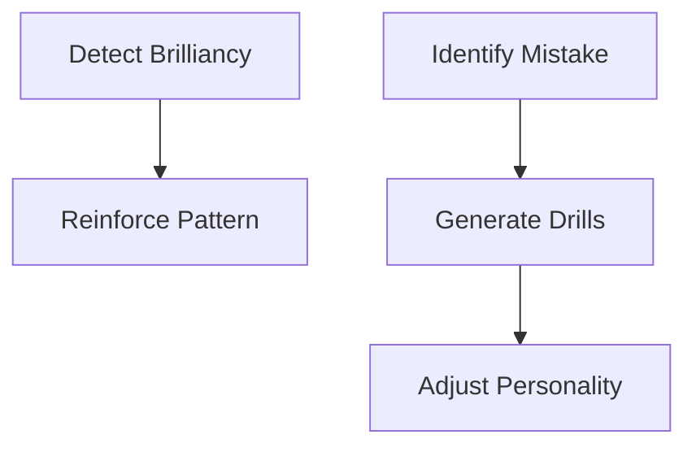

# Chess AI Development Roadmap

## 🚀 Implement ASAP (Core Improvements)

### **Self-Learning Foundations**
1. **Game Analysis Module**
   - Post-game Stockfish analysis storage
   - Win/loss attribution tracking
   - Basic mistake classification (blunder/mistake/inaccuracy)

2. **Knowledge Database**
   - Position hashing with Zobrist keys
   - Redis storage for move statistics
   ```python
   # Proposed data structure for learned knowledge
   {
    "position_hash": "a1b2c3...",
    "best_moves": [
        {"move": "e4", "win_rate": 0.62, "usage_count": 42},
        {"move": "d4", "win_rate": 0.58, "usage_count": 37}
    ],
    "common_mistakes": [
        {"move": "f4", "error_type": "positional", "severity": 0.8}
    ],
    "position_features": {
        "material_balance": +0.3,
        "king_safety": 0.6,
        "pawn_structure": "isolated"
    }
   }
   ```

### **Adaptive Personality**
- Dynamic difficulty adjustment
- Win/loss-based style modulation
- Time management adaptation

### **Critical Engine Upgrades**
- Stockfish 16+ integration
- Move caching system
- Parallel move evaluation
- GPU acceleration support

### **Essential Monitoring**
- ELO progression tracking
- Mistake frequency dashboards
- Personality trait evolution logs

## 🔮 Future Development (Advanced Features)

### **Advanced Learning Systems**
| Feature | Description |
|--------|-------------|
| Neural Network Evaluation | Replace static eval with learned NN |
| Opponent Modeling | Player-specific strategy adaptation |
| Meta-Learning Controller | Optimizes learning rate/strategies |
| Automated Puzzle Generation | Creates custom training positions |

### **Enhanced Human Simulation**


### **Infrastructure**
- Distributed Learning
  - Cluster training for opening books
  - Federated learning between instances
- Cloud Deployment
  - AWS Lambda game analysis
  - Google Cloud storage for knowledge

### **Advanced Visualization**
- Interactive mistake heatmaps
- Personality trait radar charts

## 🧪 Validation Metrics

## Implementation Roadmap
A. Post-Game Analysis Module

```markdown
- [ ] `analysis/learn.py` - Core learning system
  - Win/loss attribution modeling
  - Mistake classification (tactical/positional/blunder)
  - Brilliant move detection
- [ ] `storage/knowledge_db.py` - Redis/PostgreSQL interface
  - Position hashing via Zobrist hashing
  - Compressed storage of learned patterns
- [ ] `adaptation/adjuster.py` - Dynamic behavior modification
  - Adjusts mistake probability based on learned weaknesses
  - Reinforces strong patterns
```

B. Real-Time Learning Features

```python
# During game execution:
def make_move(position):
    move = engine.get_move(position)
    if self.learning_mode:
        anticipatory_learning(position, move)  # Predict outcomes before they happen
        update_heatmaps(position)  # Track piece activity patterns
    return move
```

C. Improvement loops

**Short-Term (per game)**
- Mistake rate reduction
- Win/loss ratio by position type

**Long-Term (monthly)**
- ELO gain per 100 games
- Human likeness score (via Turing tests)
- Training efficiency improvements
