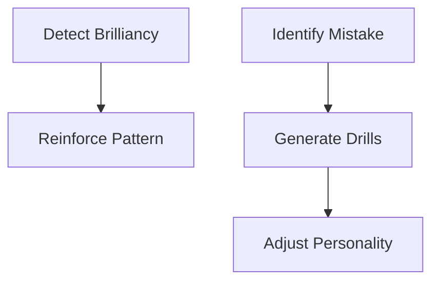

# Chess AI Development Roadmap

## 🚀 Implement ASAP (Core Improvements)

### **Self-Learning Foundations**
1. **Game Analysis Module**
   - Post-game Stockfish analysis storage
   - Win/loss attribution tracking
   - Basic mistake classification (blunder/mistake/inaccuracy)

2. **Knowledge Database**
   - Position hashing with Zobrist keys
   - Redis storage for move statistics
   ```python
   # Sample data structure
   {
       "position_hash": "abc123",
       "best_moves": [{"move": "e4", "win_rate": 0.65}],
       "common_errors": [{"move": "f6", "type": "tactical"}]
   }
   ```

### **Adaptive Personality**
- Dynamic difficulty adjustment
- Win/loss-based style modulation
- Time management adaptation

### **Critical Engine Upgrades**
- Stockfish 16+ integration
- Move caching system
- Parallel move evaluation
- GPU acceleration support

### **Essential Monitoring**
- ELO progression tracking
- Mistake frequency dashboards
- Personality trait evolution logs

## 🔮 Future Development (Advanced Features)

### **Advanced Learning Systems**
| Feature | Description |
|--------|-------------|
| Neural Network Evaluation | Replace static eval with learned NN |
| Opponent Modeling | Player-specific strategy adaptation |
| Meta-Learning Controller | Optimizes learning rate/strategies |
| Automated Puzzle Generation | Creates custom training positions |

### **Enhanced Human Simulation**


### **Infrastructure**
- Distributed Learning
  - Cluster training for opening books
  - Federated learning between instances
- Cloud Deployment
  - AWS Lambda game analysis
  - Google Cloud storage for knowledge

### **Advanced Visualization**
- Interactive mistake heatmaps
- Personality trait radar charts

## 📅 Suggested Timeline

**Phase 1 (0-4 weeks)**
- Implement basic learning database
- Add post-game analysis
- Upgrade Stockfish integration

**Phase 2 (4-8 weeks)**
- Develop adaptive personality system
- Build monitoring dashboards
- Implement opponent modeling

**Phase 3 (8+ weeks)**
- Neural network integration
- Distributed learning systems
- Advanced visualization tools

## 🧪 Validation Metrics

**Short-Term (per game)**
- Mistake rate reduction
- Win/loss ratio by position type

**Long-Term (monthly)**
- ELO gain per 100 games
- Human likeness score (via Turing tests)
- Training efficiency improvements

---

This roadmap:
1. Prioritizes immediately valuable features  
2. Groups related functionalities  
3. Includes concrete technical specs  
4. Provides measurable success criteria
